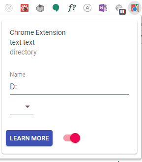

# Chrome extension



## Install

```sh
npm install
```

## Start

For development

```sh
npm start
```

http://localhost:3000/

## Watch

For auto build

```sh
npm run watch
```

## Build & Deploy

```sh
npm run build
```

upload [build](build) directory

## License

MIT
